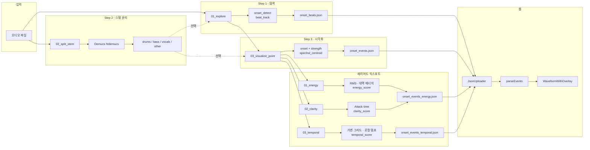

# Progress — 작업 내용 및 핵심 요약

프로젝트별·파일별 진행 상황, 값 가공 흐름, 산출물을 정리한 문서입니다.

---

## 파이프라인 아키텍처

---

## 1. 진행 현황

### 1.1 레이어링·JSON (02_layered_onset_export)

**01_energy.ipynb**

- **JSON**: `web` 호환 형식. 메타데이터 `source`, `sr`, `duration_sec`, `energy_rms_min/max`, `hop_length`, `bpm`, `total_events`. 이벤트별 `t`, `time`, `strength`, `texture`, `color`, `rms`, `e_norm`, `band_low/mid/high` + 확장 필드 `index`, `frame`, `onset_strength`, `log_rms`, `energy_score`, `E_norm_*`, `left_sec`, `right_sec`, `overlap_prev`.
- **저장**: `audio_engine/samples/onset_events_energy.json`. `web/public` 존재 시 동일 파일 복사.

**02_clarity.ipynb**

- **Clarity 안정화** (계획 반영):
  1. Envelope 스무딩: `np.abs(y_segment)` → `uniform_filter1d(..., size=3~11, mode='nearest')`
  2. Attack time: 하한 0.05 ms, 상한 50 ms clip. `attack_samples = max(t90 - t10, 1)`
  3. Valley: peak과 거리 ≥ 약 2 ms, 값 < peak의 30%인 **마지막** 로컬 최소만 사용
  4. 후처리: `attack_times`에 `median_filter(size=3, mode='nearest')`
  5. Clarity: `robust_norm(clarity_raw)` 후 상·하위 1% clip
- **임포트**: `scipy.ndimage`: `uniform_filter1d`, `median_filter`

**03_temporal.py**

- **가변 그리드 + 로컬 템포** 기반 Temporal Salience (layering.md 3) 구현.
- 로컬 템포: `librosa.feature.tempo(aggregate=None)` → onset envelope 길이로 보간 → `beat_track(bpm=tempo_dynamic)`.
- 가변 그리드: beat 구간 선형 분할 → 1/2, 1/4, 1/8, 1/16 서브비트. 계층별 가중치(1/4>1/8>1/16).
- grid_align_score: 거리 `exp(-d/tau)` × 계층 가중치. tau = beat×0.06.
- repetition_score: IOI를 beat 단위 정규화 후 0.125~2 beat 그리드 배수에 가까우면 높음. 50ms 미만 IOI 필터.
- temporal_score = grid_align × repetition × strength_weight(0.85~1.0).
- **저장**: `onset_events_temporal.json`. `web/public` 복사.

**현재 상태**

| 항목 | 메모 |
|------|------|
| 에너지 | 일관성 양호. |
| Clarity | 추가 검증 필요. 드럼 트랙에서는 의미가 제한적일 수 있음. |
| Temporal | 가변 그리드·로컬 템포·beat 정규화 IOI 적용 완료. 다음: Spectral Focus (4) 또는 Context Dependency (5). |

---

## 2. 값 가공 요약 (데이터 흐름)

각 노트북에서 **입력 → 계산 → 정규화 → JSON/시각화**로 이어지는 흐름을 요약합니다.

### 2.1 01_explore.ipynb

| 단계 | 값 | 가공 |
|------|-----|------|
| Onset | `onset_strength` → `onset_detect` | delta=0.05, wait=2, backtrack=True, hop_length=256 → `onset_times_sec` |
| Beat | `beat_track` | `tempo_bpm`, `beat_times_sec` |
| 드럼 스템 | (선택) | `drums.wav` 있으면 동일 파라미터로 onset 재계산 → `drum_onset_times_sec` |
| JSON | — | 위 리스트 그대로 저장. 정규화 없음. |

### 2.2 03_visualize_point.ipynb

| 단계 | 값 | 가공 |
|------|-----|------|
| 세기 | `onset_strength` → `onset_detect` | `strengths = onset_env[onset_frames]` (원시) |
| 질감 | `spectral_centroid` | `textures = centroid[0, onset_frames]` (Hz) |
| JSON strength | `strengths` | min–max → 0~1 |
| JSON texture | `textures` | min–max → 0~1. `texture_hz`는 원시 Hz |
| 시각화 점 크기 | `strengths` | min–max 후 30~500 선형 매핑 |

### 2.3 01_energy.ipynb (02_layered_onset_export)

| 단계 | 값 | 가공 |
|------|-----|------|
| Onset | `onset_detect` (delta=0.07, wait=4) + `refine_onset_times` | ±80 ms, hop_refine=64 로컬 피크 → `onset_times`, `strengths` |
| 구간 | 이벤트 i | `mid_prev`/`mid_next` = 인접 onset 시간의 중점. seg = y[start:end] |
| RMS | seg | `rms = sqrt(mean(seg²))`. `log_rms = log(1e-10 + rms)` |
| 대역 에너지 | seg, n_fft=2048 | rfft 절대값 제곱. Low 20–150, Mid 150–2k, High 2k–10k Hz 구간 합 |
| energy_score | rms | `robust_norm(log_rms)` → 0~1 (median/MAD, clip(0.5+z/6, 0, 1)) |
| E_norm_* | band_energy | 각 대역별 `robust_norm` → 0~1 |
| JSON | — | `strength`=energy_score, `texture`=E_norm_high. 원시·정규화 값 모두 포함 |

### 2.4 02_clarity.ipynb (02_layered_onset_export)

| 단계 | 값 | 가공 |
|------|-----|------|
| Onset | 01_energy와 동일 | `refine_onset_times`까지 동일 |
| 윈도우 | 이벤트 i | `pre_sec = min(50ms, 0.45*gap_prev)`, `post_sec = min(20ms, 0.45*gap_next)` |
| Envelope | y_segment | `abs(y)` → `uniform_filter1d(env, size=3~11)` |
| Valley | peak 이전 | 거리 ≥ 약 2 ms, 값 < peak 30%인 **마지막** 로컬 최소 |
| 10%–90% | pre_peak_env | t10/t90 선형 보간. `attack_samples = max(t90-t10, 1)` |
| attack_time_ms | attack_samples | `(attack_samples/sr)*1000` → clip(0.05, 50) ms |
| 후처리 | attack_times | `median_filter(size=3, mode='nearest')` |
| clarity_raw | — | `safe_attack = clip(attack_times, 0.1, None)`. `strengths * (1/safe_attack)` |
| clarity_score | clarity_raw | percentile 1–99 정규화 → 0~1, 이후 상·하위 1% clip |
| JSON | — | `attack_time_ms`, `clarity_score` 저장 |

### 2.5 03_temporal.py (02_layered_onset_export)

| 단계 | 값 | 가공 |
|------|-----|------|
| Onset | 01_energy와 동일 | `refine_onset_times`까지 동일 |
| 로컬 템포 | `librosa.feature.tempo(aggregate=None, std_bpm=4)` | onset_env 길이로 보간 → `beat_track(bpm=...)` |
| 비트 | beat_track | `beats_dynamic` (가변 템포 반영) |
| 가변 그리드 | beats_dynamic | 1/2, 1/4, 1/8, 1/16 서브비트. 계층 level(1,2,4,8,16) 저장 |
| grid_align_score | onset_times vs grid | `exp(-d/tau)` × level_weight. tau=beat×0.06 |
| repetition_score | IOI (prev/next) | beat 정규화 → 0.125~2 beat 그리드 배수 근접도. 50ms 미만 필터 |
| temporal_score | — | `grid_align × repetition × strength_weight(0.85~1.0)`. robust_norm |
| JSON | — | `grid_align_score`, `repetition_score`, `temporal_score`, `ioi_prev/next` |

---

## 3. 오디오 엔진 (파일별)

### 3.1 01_explore.ipynb

**역할**  
음악 파형 탐색 + Onset/Beat 기본 검출 (Step 1).

**작업**

- 오디오 로드, 전체/확대 파형 시각화 (10~15초 구간).
- Onset: `librosa.onset.onset_detect` (delta=0.05, wait=2, backtrack=True, hop_length=256).
- Beat: `librosa.beat.beat_track` → BPM, 박자 그리드.
- 드럼 스템: `stems/htdemucs/{트랙명}/drums.wav` 있으면 해당 파일로 onset 재계산.
- JSON: `audio_engine/samples/onset_beats.json` (source, sr, duration_sec, tempo_bpm, onset_times_sec, beat_times_sec, 선택 drum_onset_times_sec). 값 가공은 §2.1 참고.
- 시각화: 파형 위 beat(주황), onset(빨강), 드럼 onset(초록) 세로선.

**핵심**  
Step 1 산출물(onset/beat 리스트 + JSON). 드럼 스템 사용 시 타격점 검출 수 증가.

---

### 3.2 02_split_stem.ipynb

**역할**  
Stem 분리 검증 (Step 2).

**작업**

- Demucs(htdemucs)로 4 stem 분리.
- 출력: `samples/stems/htdemucs/{트랙명}/` — drums, bass, vocals, other.
- 엔진: `audio_engine/engine/stems.py` `separate()` (필요 시 MP3→WAV 후 Demucs).

**핵심**  
drums stem 확보 → 01_explore·03_visualize_point 드럼 입력으로 사용.

---

### 3.3 03_visualize_point.ipynb

**역할**  
타격점 세기·질감 시각화 (Step 1 확장).

**작업**

- 입력: 원본 또는 드럼 스템 경로 1개.
- Onset + 세기: `onset_strength` → `onset_detect` → `strengths = onset_env[onset_frames]`.
- 질감: Spectral Centroid (Hz) — `spectral_centroid` 프레임별 계산 후 onset 프레임만 추출.
- 값 가공: §2.2 참고 (JSON strength/texture min–max 0~1, 시각화 점 크기 30~500).
- 시각화: 파형 + scatter(시간·진폭, 점 크기=세기), 시간–질감 scatter 전체/확대(12초).
- JSON: `audio_engine/samples/onset_events.json` — events (t, strength 0~1, layer, color, texture_hz).

**핵심**  
세기=점 크기, y=질감(Hz)로 타격 특성 구분. 웹 시각화용 events JSON.

---

### 3.4 01_energy.ipynb, 02_clarity.ipynb, 03_temporal.py (02_layered_onset_export)

- **01_energy**: 구간별 RMS·대역 에너지 → energy_score, E_norm_* → JSON. §2.3 참고.
- **02_clarity**: 구간별 Attack Time(10%→90%) → clarity_score → JSON. §2.4 참고.
- **03_temporal**: 가변 그리드·로컬 템포 → grid_align_score, repetition_score → temporal_score → JSON. §2.5 참고.

---

### 3.5 audio_engine/engine/

| 파일 | 역할 | 비고 |
|------|------|------|
| stems.py | Demucs 래퍼 | 비-WAV는 WAV 변환 후 실행, stem별 wav 경로 반환 |
| schemas.py | 결과 스키마 | 스텁(주석) |
| keypoints.py | 키포인트 추출 | 스텁(주석) |
| viz.py | 시각화 유틸 | 스텁(주석) |

---

## 4. 웹 (web)

**역할**  
파형 + 이벤트 포인트 오버레이 시각화.

**구성**

- **JsonUploader**: JSON 업로드 → `parseEventsFromJson` → `EventPoint[]`.
- **WaveformWithOverlay**: 파형 + 이벤트(세로선/마커), 레이어별 토글.
- **parseEvents.ts**: `onset_times_sec` 단일 배열 또는 `events` 배열 → `{ t, strength?, color?, layer? }` 정규화.

**핵심**  
`onset_beats.json` 또는 `events` JSON 업로드 시 파형 위 타격점 표시.

---

## 5. 문서 참조

| 문서 | 내용 |
|------|------|
| docs/personal.md | 테스트/검증 로드맵(Step 0~7), 산출물, 우선순위 |
| docs/json_spec.md | 파일별 JSON 형식 및 Web 수용 형식 |
| docs/progress.md | 본 문서 — 진행 상황·값 가공·파일별 요약 |
